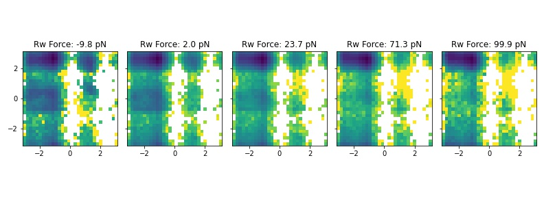

# PLUMED Masterclass 22.15: FISST module and application of mechanical forces with PLUMED

## Origin

This masterclass was authored by Glen M. Hocky on October 17, 2022

## Aims

This Masterclass explains how mechanical forces can be modeled using PLUMED, and the application of the FISST module for applying multiple forces simultaneously.

## Objectives

The objectives of this Masterclass are:
- Learn how to apply a constant force in PLUMED
- Learn how to perform steered-MD in PLUMED, and approximately get a free energy surface from repeating this calculation
- Learn how to apply constant forces with FISST, and reweight to different intermediate forces

## Prerequisites

We assume that the person that will follow this tutorial is familiar with the Linux terminal, Gromacs and basic functionality of PLUMED.

Familiarity with python and matplotlib is recommended for FISST reweighting and plotting

## Setting up PLUMED

We will use GROMACS, LAMMPS, PLUMED, and PLUMED's pesmd function to perform the calculations.
Conda packages with the software required for this class have been prepared and you can install them following the instructions in [this link](https://github.com/plumed/masterclass-2022).

If you are compiling PLUMED on your own, you will need to install the FISST module manually by adding '--enable-modules=fisst' to your './configure' command when building PLUMED.

The data needed to run the exercises of this Masterclass can be found on [GitHub](https://github.com/hockyg/masterclass-22-15).
You can clone this repository locally on your machine using the following command:

````
git clone https://github.com/hockyg/masterclass-22-15
````

## Background

A force along some direction here is defined as the negative gradient of the potential energy along that direction. 

A constant force $F$ on a scalar collective variable $Q(\vec{X})$ therefore is a simple addition to the system's energy function.

$$
 U(\vec{X},F) = U(\vec{X}) - F Q(\vec{X}) 
$$

Notice that, because of the negative sign, a postive value of $F$ results in a lower energy for large values of $Q$, meaning $F\gt0$ corresponds to a "pulling" force.

A mechanical force would often in reality would correspond to pulling apart two atoms, and so $Q$ would often be a simple distance coordinate.

Note however, that other quantities could be used, such as an area which would mean $F$ corresponds to a pressure.

Dimensional analysis implies that the units of $F$ must be [Energy]/[Q].

The effect of constant force can be assessed using any enhanced sampling method.

The work done by the bias in this case is very simple

$$
W = \int_a^b F \cdot d Q = F ( Q_b - Q_a )
$$

Constant forces can be applied in PLUMED with the SLOPE keyword of the RESTRAINT bias.

## Steered MD

Steered molecular dynamics (SMD) is one way of pulling on a molecular coordinate, and has a connection to experiments done where a molecule is attached via a "spring" to an object such as an optical tweezer or AFM tip. To represent this in simulation, instead of applying a constant force, we impose a Harmonic restraint on $Q$ with a center that moves:

$$
 U(\vec{X},F) = U(\vec{X}) + \frac{1}{2} k (Q-Q_0(t))^2
$$

Typically $Q_0(t)$ would move linearly, with $ Q_0(t) = Q_0(0)-\lambda t $ although that is not a requirement. 

At any given time, the force along $Q$ from the moving bias is given as:

$$
 F(t) = -\frac{\partial U}{\partial Q} = -k(Q-Q_0(t))
$$

This force is positive (pulling) when $Q_0(t)$ is bigger than $Q$, and it can get very large if the spring moves quickly to larger values.

SMD is implemented in PLUMED using the MOVINGRESTRAINT bias, and the work is computed automatically.

$$
W = \int_a^B F dQ \approx \sum_{i=1}^{N_{steps}} \bar{F}_i (Q_0(t_i)-Q_0(t_{i-1})) = \lambda dt \sum_{i=1}^{N_{steps}} \bar{F}_i, 
$$

$$
\bar{F_i}=\frac{1}{2}( F_{i}+F_{i-1} ) = -\frac{k}{2}( Q(t_i)-Q_0(t_i) -Q(t_{i-1})+Q_0(t_{i-1})) = -\frac{k}{2} (\Delta Q_i - \lambda d t)
$$

## FISST

Infinite Switch Simulated Tempering in Force (FISST) is a method implemented  in [this paper](https://doi.org/10.1063/5.0009280) and demonstrated to be compatible with replica exchange approaches in [this paper](https://doi.org/10.1021/acs.jpcb.3c07081)

This method takes advantage of the limit of changing a force from $F_{min}$ to $F_{max}$ and back infinitely quickly.

In this limit, the system feels an average force $\bar{F}(Q)$ that depends on the current value of the pulling coordinate.

$$
 U(\vec{X},F) = U(\vec{X}) - \bar{F}(Q) Q(\vec{X}) 
$$

In practice, this $\bar{F}(Q)$ is computed using weights $w(F)$ for each force in the force range that are learned on the fly, and separate "observable weights" $W_F(Q_i)$ are used to compute the average of any quantity $A$ at a given force.

$$
\langle A \rangle_F = \frac{1}{N} \sum_{i=1}^{N_{steps}} A(X(t_i)) W_F(Q_i)
$$

where the observable weights are computed in a way that 

$$
W_F(Q_i)\propto \left(\int_{F_{min}}^{F_{max}} dF' w(F') e^{\beta (F'-F) Q_i} \right)^{-1}
$$

The module writes out both the force weights and the observable weights to files.

## Exercises

The exercises are presented below.

### Effect of force on a 1-dimensional potential

Use the RESTRAINT function to add a constant force of different magnitudes (e.g. -5 to 5 in these units) and look at how the force changes the resulting free energy surface.

```plumed
UNITS ENERGY=kcal/mol

d1: DISTANCE ATOMS=1,2
ff: MATHEVAL ARG=d1 PERIODIC=NO FUNC=0.2*(((x-10)^2)*((x-20)^2))
bb: BIASVALUE ARG=ff

metad: METAD ARG=d1 PACE=500 HEIGHT=0.1 SIGMA=2.5 FILE=__FILL__ BIASFACTOR=10 TEMP=300.0 GRID_WFILE=__FILL__ GRID_MIN=0 GRID_MAX=30 GRID_BIN=251 GRID_WSTRIDE=10000

RESTRAINT __FILL__

PRINT ARG=* FILE=__FILL__ STRIDE=100
```

Then run the simulation using the command:

````
plumed pesmd < doublewell_prod.pesmd.input
````

Plot the free energy surface from the GRID or after using sum_hills to compute the surface, and zero the potential at the left minimum. What do you notice about the other minimum and barrier?


### Effect of force on a 2-dimensional potential

The following implements a "V-shaped" potential which has 2 minima at small y values and 1 minima at large y value. 

Try plotting the potential to see.

```plumed
d1: DISTANCE ATOMS=1,2 COMPONENTS
ff: MATHEVAL ARG=d1.x,d1.y PERIODIC=NO FUNC=-8*log((exp(-(y-exp(-x))^2/2)+exp(-(y+exp(-x))^2/2))*exp(-x^2/2))
bb: BIASVALUE ARG=ff

PRINT ARG=* FILE=__FILL__ STRIDE=100
```

First run a simulation using the command, and make a 2d histogram of x and y to show that it is trapped on one side. 

````
plumed pesmd < doublewell_prod.pesmd.input
````

If you have time, use RESTRAINT to add a constant force in the Y direction that favors the higher vertical state.

Now add FISST in order to sample forces all at once:

```plumed
f: FISST MIN_FORCE=-15 MAX_FORCE=15.0 PERIOD=200 NINTERPOLATE=41 ARG=d1.x KBT=1.0 OUT_RESTART=__FILL__ OUT_OBSERVABLE=__FILL__ OBSERVABLE_FREQ=100 CENTER=0
```

We used forces -15 to 15 in the paper, but feel free to experiment with your own force range. Inspect the observable file and restart file to see what is in there.

Now generate a histogram at each force using the following command, which will render it as an animated gif if you have the proper libraries installed.

````
python reweight_vshape.py observable_file cv_file
````


### Model bistable helix

In this section, we will study a toy model of a a helix using a bead spring model in lammps. This model has lowest energy when it is in a left or right handed helix, but it is not chiral, so they must have the same free energy.

First, run the system without any pulling, if you fisualize the trajectory, you will see that it is stuck in one configuration (epsilon sets the strength of the bonds, it can be studied at lower or higher stabilities by changing eps).

````
lmp -log helix_sf_example.log \
           -var plumed_file helix_sf_f-4.5_eps7.5_10000000.plumed.dat  \
           -var outprefix helix_sf_pull0 \
           -var steps 10000000  \
           -var eps 7.5 \
           -in run_helix_plumed.lmp
````

Now, run the system using FISST, suitibly modifying the plumed file to impose a force from -2 to 8 (as studied in the paper)

````
lmp -log helix_sf_example.log \
           -var plumed_file helix_fisst_fmin-2.0_fmax8.0_eps7.5_50000000.plumed.dat  \
           -var outprefix helix_fisst_fmin-2.0_fmax8.0_eps7.5_50000000 \
           -var steps 50000000  \
           -var eps 7.5 \
           -in run_helix_plumed.lmp
`````

The included script 'compute_handedness.py' has an ad-hoc handedness calculation which is computed using RMSD to a left and right handed helix. 
The end-end distance is already computed in the colvars file.

Use the handedness calculation in this script to create a 2d FES from the unbiased simulation, and from the unweighted FISST data.


Note that both sides are equally explored in this relatively long simulation. 
Then compute plots reweighted to small/negative forces and large forces, and notice how the result mirrors that from the V-shaped potential.

 

### Solvated alanine-10

We will now study the effect of force on a model peptide, alanine 10 in water. You can set this up to run yourself, but the colvar files are also included for a 200ns simulation of alanine 10 run with FISST from forces -10 to 10 pN and from -10 to 100 pN.

Note, now we are using real units, a conversion factor is needed: 69.4786 pN = 1 kcal/mol/Angstrom

To run yourself, modify ala10_fisst.plumed.dat

````
gmx_mpi -s ala10.tpr -plumed ala10_fisst.plumed.dat -nsteps 100000000 --deffnm OUTPUT_PREFIX
````

Then analyze your files, or my files ala10_pull_fRange_fmin-10_fmax100.* to compute the end-end distance of Alanine 10 at different forces.
Do your results from different FISST ranges agree?

 

Finally, use the observable weights to compute the Ramachandran plot (averaged over residues) at different forces (mine is from analyzing the gromacs structural output, but you may want to put the phi-psi calculation in the plumed file as in previous tutorials!)

 
