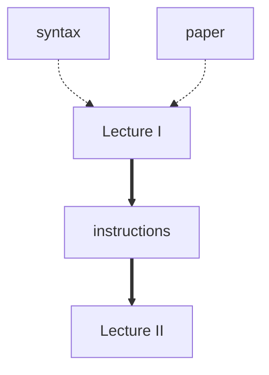

# Masterclass 22.15: Mechanical pulling + FISST module

This lesson was given as part of the PLUMED masterclass series in 2022.  It includes:

* Two videos that describe the theory. 
* A series of exercises for you to complete.

The flow chart shown below indicates the order in which you should consult the resources.  You can click on the nodes to access the various resources.  Follow the thick black lines for the best results.  The resources that are connected by dashed lines are supplmentary resources that you may find useful when completing the exercise.

This lesson was the fifteenth masterclass in the 2022 series.

